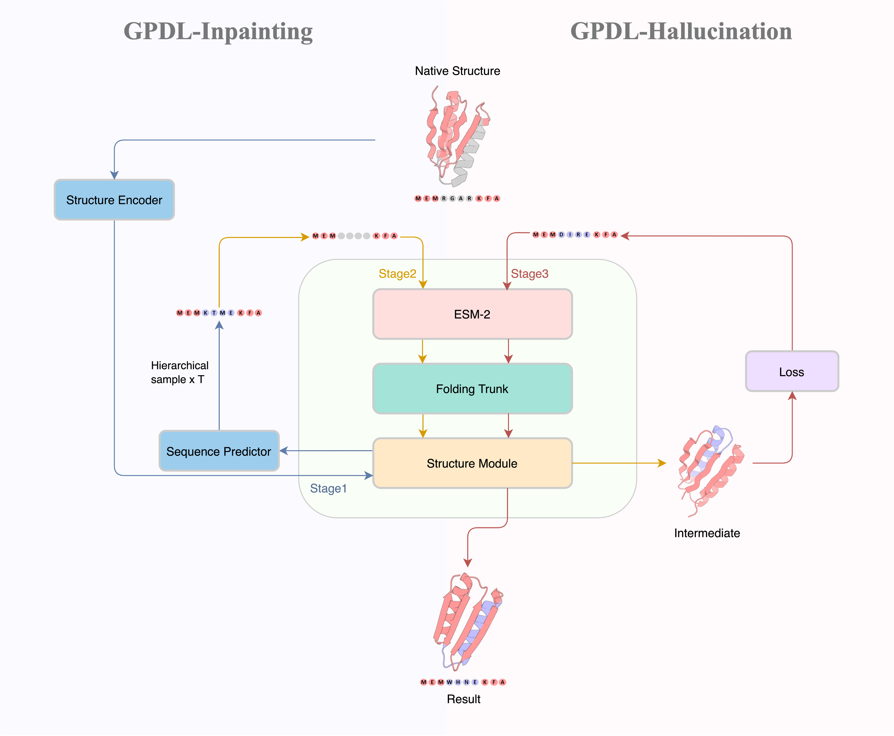

<h1 align="center">GPDL</h1>
<p align="center">Generative Protein Design by Language model</p>




GPDL is a deep learning method to **design novel and high quality scaffold backbone** given the desired motif residue topologies and sequences. Included in this code repository are two distinct methods, each offering a balance between generation speed and output quality.

## 💻 Environment set-up

### Conda environment
> We used the same environment from https://github.com/facebookresearch/esm
```
# install esmfold and openfold 
conda create -n gpdl python=3.8
conda activate gpdl
conda install pip
conda install pytorch torchvision torchaudio cudatoolkit=11.3 -c pytorch
conda install -c conda-forge biotite
pip install "fair-esm[esmfold]"
pip install 'dllogger @ git+https://github.com/NVIDIA/dllogger.git'
pip install 'openfold @ git+https://github.com/aqlaboratory/openfold.git@4b41059694619831a7db195b7e0988fc4ff3a307'

# install esm_if
conda create -n esm_if python=3.9
conda activate esm_if
conda install pytorch cudatoolkit=11.3 -c pytorch
conda install pyg -c pyg -c conda-forge
conda install pip
pip install biotite==0.36.1
pip install git+https://github.com/facebookresearch/esm.git
```

### Third party source code

Our repo keeps a fork of ProteinMPNN in `./ProteinMPNN`. Our conda environment is sufficient for running the ProteinMPNN codes to generate sequences compatible with our backbones.

```
git clone https://github.com/dauparas/ProteinMPNN.git
```


## 🔮 GPDL tutorial
GPDL takes three-steps module by seeding-fix bb design-optimization in `example.sh`. Usually it needs 30 minutes for 100 backbones to generate protein scaffolds. Here is the bash parameters:
1. `protein_name` - Output path prefix
2. `dir_name` - Usually same as `protein_name`
3. `inpaint_seq` - This defines the motif information format, like `"m,Ax-y,m"`, where m,n is the generated scaffold length and the motif position begins from A chain residue x to A chain residue y
4. `mask_len` - The scaffold length of each segment which should be the same with `inpaint_seq`
5. `motif_id` - The motif position which should be the same with `inpaint_seq`
6. `max_mut`- Maximum residues can be mutated in the beginning.
7. `step` - Total MCMC iteration steps.
8. `temp_dir` - Temp folders for MCMC and seeding module results
9. `final_des_dir` - Final output PDBs
10. `reference` - Native extraction PDB
11. `inp_num` - Total number of designs in each bash file

## ✏️ Citation

If you use the framework in your research, please cite the following paper.

```
@article {GPDL,
    Author={Bo, Zhang and Kexin, Liu and Zhuoqi, Zheng and Yunfeiyang, Liu and Ting, Wei and Haifeng, Chen},  
    title={Protein Language Model Supervised Precise and Efficient Protein Backbone Design Method},  
    year={2023},
    doi={10.1101/2023.10.26.564121},
    url={https://www.biorxiv.org/content/10.1101/2023.10.26.564121v1},
    journal={bioRxiv}
}
```

---

Github codebase author : Bo Zhang, Kexin Liu, Zhuoqi Zheng

E-mail : {zhangbo777,lkxlkx,h2knight}@sjtu.edu.cn
