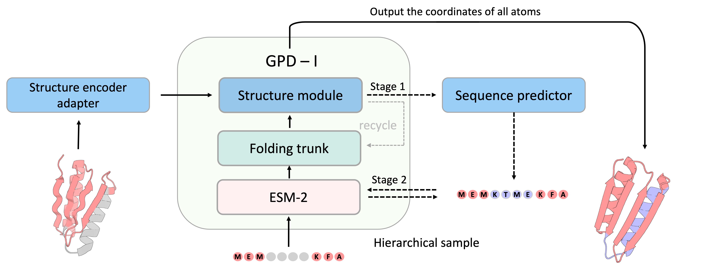

# GPDL (Generative Protein Design by Language-model)
----

Note that this is an ongoing project and many work still needs to be done.

## Inpainting
- Using ESMFold to generate scaffold proteins for the functional sites (which is also called inpainting). The basic formuler is $s,t \sim f_{\theta}(\hat{s},\hat{t})$ , $s,\hat{s},t,\hat{t}$ is the whole sequene, whole structures, motif seqs and motif structures. $f_{\theta}$ is the ESM-Inpainting network and its parameters.

- Only structure module and some linear projection layers(like distance linear layer and sequence output embedding) were trained.

- Requirement : any requiment in latest ESMFold https://github.com/facebookresearch/esm

-----
Author : Bo Zhang, Kexin Liu, Zhuoqi Zheng

E-mail : {zhangbo777,lkxlkx,h2knight}@sjtu.edu.cn
